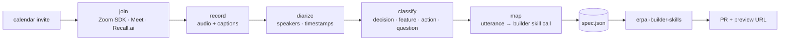

<div align="center">

# `shruti`

### the meeting agent

**Joins the call. Records. Diarizes. Turns speech into a working app.**

[](./LICENSE)
[](#roadmap)

</div>

Sanskrit *shruti*, "what is heard." Sister to `smriti`, "what is
remembered." A meeting agent: dials into Zoom or Meet from a calendar
invite, captures audio + captions, diarizes, classifies utterances into
decisions / feature requests / action items, and emits a structured
`spec.json` ready for the ERP•AI app builder.

> **The thesis.** The fastest specification language is speech.
> Stakeholders don't write user stories — they say things in meetings.
> The agent that turns *"add a vendor onboarding form with a W-9 upload"*
> into a working app, before the meeting ends, wins. The bot is the easy
> part; the structured spec is the hard part.

---

## ✦ Pipeline



## ✦ Public scope (this repo)

- **Bot adapters**: Zoom Meeting SDK, Google Meet REST, Recall.ai fallback
- **Transcript schema**: utterances with speaker, timestamps, captions
- **Classifier**: utterance → `{decision, feature_request, action_item, question, schema_change}`
- **Spec emitter**: structured JSON ready for downstream builders
- **Reference CLI**: `shruti extract <transcript.json> > spec.json`

The downstream — `spec.json → working ERP app` — lives in
`erphq/erpai-builder-skills` (private). This repo is the meeting half.

## ✦ Spec format

```json
{
  "meeting_id": "2026-04-30-vendor-ops-sync",
  "items": [
    {
      "kind": "feature_request",
      "speaker": "Maria Chen",
      "ts": [1834.2, 1851.7],
      "quote": "we need a vendor onboarding form with a W-9 upload",
      "intent": "add_form",
      "params": {"entity": "vendor", "fields": ["w9"]}
    },
    {
      "kind": "decision",
      "speaker": "Sam Patel",
      "ts": [2104.1, 2110.0],
      "quote": "let's go with the existing approval flow for now",
      "intent": "scope_decision"
    }
  ]
}
```

## ✦ Usage

```bash
shruti join --invite meeting.ics                       # bot dials in
shruti record --zoom-sdk-token $TOK --meeting 123      # alternative
shruti extract transcript.json > spec.json             # offline mode
```

## ✦ Roadmap

- [ ] v0.1 — transcript schema + extract→spec.json CLI (offline)
- [ ] v0.2 — Recall.ai adapter (cross-platform shortcut)
- [ ] v0.3 — Zoom Meeting SDK direct
- [ ] v0.4 — Google Meet integration
- [ ] v0.5 — diarization (whisper.cpp + pyannote)
- [ ] v1.0 — wired to `erpai-builder-skills`, end-to-end demo

## ✦ License

MIT — see [LICENSE](./LICENSE).
